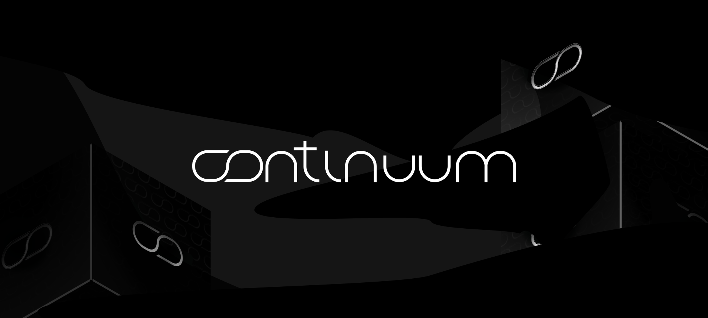

# Continuum Protocol

> Continuum is a **universal interoperability solution** with a **forward-compatible EVM layer**, built with **trust minimization** at its core.

## Key properties

- **Trust-minimized interoperability**: Cross-chain messaging modeled as authenticated communication between replicated state machines, backed by light clients and zk light clients.
- **Forward-compatible EVM**: Runs existing EVM contracts and tooling while exposing new verification and cryptographic primitives via precompiles and extensions.
- **Cosmos-native integration**: Access core Cosmos modules (bank, staking, governance, etc.) directly from Solidity.
- **Heterogeneous interop**: Native support for IBC-style flows, Solana-aware parsing and verification, and rich cryptographic support.
- **Production-ready ecosystem surface**: Ships widely used pre-deployed contracts (Multicall, Safe factories, Permit2, WETH, etc.) at well-known addresses.

---

## Interoperability

Continuum treats interoperability as a problem of **authenticated communication between replicated state machines**.

### Trust minimization by construction

Many cross-chain systems introduce an additional trust domain (operator committees, multisigs, MPC/TSS groups, external verifier networks). Continuum's design goal is to **avoid adding a privileged correctness third party** by emphasizing **light-client verification** and **on-chain zk light clients**.

In this model, safety reduces to the security assumptions of the underlying chains' consensus plus the soundness assumptions of the proof system used for succinct verification. Empirically, a significant fraction of cross-chain losses come from compromising the *bridge's* trust perimeter rather than compromising the *base chains*.

---

## Execution layer

Continuum provides an EVM environment for **standard Ethereum developer workflows** (Solidity, JSON-RPC, familiar tooling), but treats the VM as an extensible surface via precompiles and custom extensions. This allows Continuum to introduce new verification and cryptographic primitives while remaining compatible with existing contracts.

### Compatibility with Ethereum

Continuum is **forward-compatible** with Ethereum:

- It can run any valid smart contract from Ethereum.
- It can implement new features that are not yet available on the standard Ethereum EVM, effectively moving the standard forward.

### Precompiles

Precompiles are **natively executed system interfaces** exposed at fixed addresses. They are used when (a) a computation is too costly or complex in EVM bytecode (e.g., SNARK verification, advanced signature schemes), or (b) contracts must safely interface with **native chain modules** without re-implementing them in Solidity.

Continuum exposes a curated set of precompiles that emphasize interoperability and cryptographic expressiveness:

- **IBC-style light clients & token transfers** – Expose light-client verification and standardized IBC fungible token transfers directly to Solidity (`ics02`, `ics20`), enabling trust-minimized cross-chain messaging and asset movement without bespoke bridges.

- **zkVM proof verification (SP1 verifiers and ZK hashes)** – Native precompiles for SP1 `Groth16`/`Plonk` proof verification and ZK-efficient hashes (e.g., `Poseidon`), enabling "prove off-chain, verify on-chain" designs such as zk light clients and succinct state attestations.

- **Advanced and post-quantum cryptography**: Precompiles for PQ signatures (`ML-DSA`, `SLH-DSA`), partial signature verification (`FROST`), and multiple signature schemes/curves (`Schnorr`, `Schnorrkel`, `P-256`) for compatibility with existing systems.

- **Solana-aware verification**: Let contracts parse Solana transactions via `solanatx` and verify `Ed25519` signatures, making heterogeneous Ethereum–Solana flows first-class citizens.

- **Verifiable randomness**: A verifiable random function `ecvrf` precompile that enables unbiased, publicly auditable randomness for lotteries, leader selection, and randomized protocols.

- **Data & UX precompiles**: `json`, `addresstable`, `bech32` for structured JSON parsing, address compression, and bech32/EVM address bridging improve both developer ergonomics and end-user UX in multi-domain applications.

- **Cosmos modules from Solidity**: Precompiles for core Cosmos functionality (`bank`, `staking`, `distribution`, `governance`, `slashing`, ERC-20 surfaces, and custom validator rewards) let contracts reason about and control the underlying chain's native economic and governance mechanisms.

For a full catalogue of precompiles and detailed semantics, see [`precompiles.md`](./docs/precompiles.md).

### Pre-deployed contracts

Continuum also ships with a curated set of **pre-deployed ecosystem contracts** at well-known addresses, mirroring Ethereum / rollup practice (e.g., OP Stack preinstalls). This removes the "bootstrap tax" of deploying basic infra (Safe factories, Multicall, Permit2, deterministic deployers) and makes Continuum immediately compatible with existing SDKs and tooling.

| Name                        | Standard                                             | Address                                      | Description |
| --------------------------- | ---------------------------------------------------- | -------------------------------------------- | ----------- |
| `Create2`                   | Deterministic deployment helper (EIP-1014)          | `0x13b0D85CcB8bf860b6b79AF3029fCA081AE9beF2` | Predictable contract addresses for counterfactual and multi-chain deployments. |
| `Multicall3`                | Batched calls (read & write)                        | `0xcA11bde05977b3631167028862bE2a173976CA11` | Aggregate many calls into one transaction for efficient queries and execution. |
| `Permit2`                   | Shared token approvals (Uniswap)                    | `0x000000000022D473030F116dDEE9F6B43aC78BA3` | Standardized approvals and permit flows, improving UX across many protocols. |
| `Safe singleton factory`    | Safe canonical factory                              | `0x914d7Fec6aaC8cd542e72Bca78B30650d45643d7` | Instantly compatible with Safe-based multisig and smart-account tooling. |
| `EIP-2935 history storage`  | Historical block-hash storage                       | `0x0000F90827F1C53a10cb7A02335B175320002935` | Exposes an extended window of block hashes for protocols that need history. |
| `EIP1820 registry`          | Interface registry / pseudo-introspection           | `0x1820a4B7618BdE71Dce8cdc73aAB6C95905faD24` | Standard on-chain registry for interface detection and implementer lookup. |
| `EIP2470 singleton factory` | Deterministic singleton factory                     | `0xce0042B868300000d44A59004Da54A005ffdcf9f` | Deploy the same singleton bytecode to the same address on any network. |
| `CreateX`                   | Universal contract deployer                         | `0xba5Ed099633D3B313e4D5F7bdc1305d3c28ba5Ed` | Flexible CREATE/CREATE2-style deployments via a single well-known address. |
| `MultiSend`                 | Generic batch transaction executor (Safe)           | `0x998739BFdAAdde7C933B942a68053933098f9EDa` | Execute multiple operations atomically from Safe and smart-account flows. |
| `MultiSendCallOnly`         | Batch executor without `DELEGATECALL`               | `0xA1dabEF33b3B82c7814B6D82A79e50F4AC44102B` | Safer batched execution that forbids `DELEGATECALL` by construction. |
| `UniversalSigValidator`     | EIP-6492 signature validator for pre-deploy wallets | `0x7dd271fa79df3a5feb99f73bebfa4395b2e4f4be` | Supports account-abstraction flows with "not-yet-deployed" smart accounts. |
| `WETH9`                     | Canonical wrapped-native token                      | `0xc8ef4398664b2eed5ee560544f659083d98a3888` | ERC-20 wrapper for the native token, making it usable in existing DeFi tools. |

For additional context and references, see [`predeploys.md`](./docs/predeploys.md).

---

## Getting started

To deploy a local node:

1. Build the node:

```bash
make install
```

2.	Start a local node:

```bash
./local_node.sh
```

3.	Connect an EVM wallet or dev tool (e.g., [Foundry](https://github.com/foundry-rs/foundry), [Hardhat](https://github.com/NomicFoundation/hardhat), [ethers.js](https://github.com/ethers-io/ethers.js/)) to the exposed JSON-RPC endpoint (check `local_node.sh` for the default RPC URL and chain ID).

### Mainnet

| **Network Name** | `c8ntinuum` |
| ------------------ | ------------- |
| **HTTP RPC URL** |  `https://evm.c8ntinuum.io` |
| **WebSocket RPC URL** | `wss://evm-ws.c8ntinuum.io` |
| **Chain ID** | `2184` |
| **Currency Symbol** | `CTM` |
| **Block Explorer** | [`CTMScan`](https://ctmscan.io) |

## Contributing

We welcome open source contributions and discussions! For more on contributing, read the [guide](./CONTRIBUTING.md).

## Open-source License & Credits

Continuum is fully open-source under the [`Apache 2.0 license`](./LICENSE). It is based on and extends [Cosmos EVM](https://github.com/cosmos/evm).
