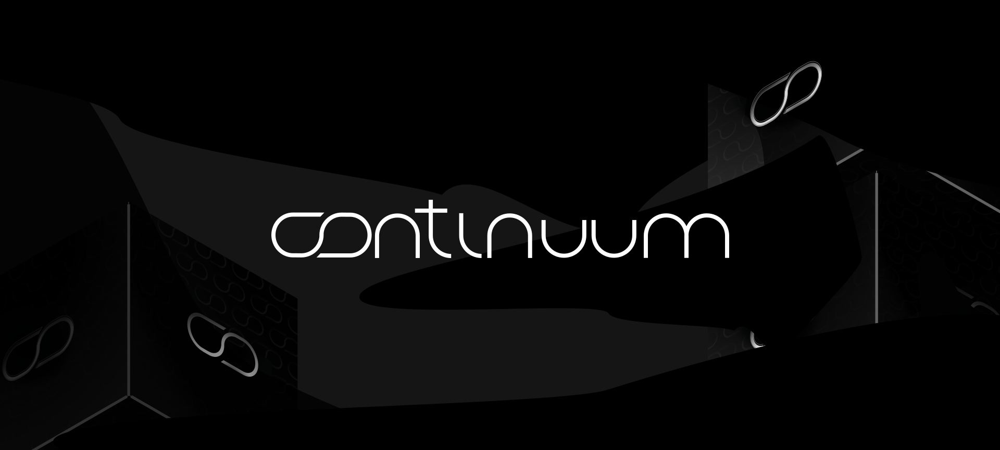

# Continuum Protocol

> Continuum is a **universal interoperability solution** with a **forward-compatible EVM layer**, built with **trust minimization** at its core.

## Interoperability

Continuum treats interoperability as a problem of **authenticated communication between replicated state machines**. Concretely, a receiving chain should accept a cross-chain message only if it can validate (i) a *remote consensus view* and (ii) a *state membership claim*.

### Trust minimization by construction

Many cross-chain systems introduce an additional trust domain (operator committees, multisigs, MPC/TSS groups, external verifier networks). Continuum's design goal is to **avoid adding a privileged correctness oracle** by emphasizing **light-client verification** and **on-chain zk light clients**. In this model, safety reduces to the security assumptions of the underlying chains' consensus plus the soundness assumptions of the proof system used for succinct verification. Empirically, a significant fraction of cross-chain losses come from compromising the *bridge's* trust perimeter rather than compromising the *base chains*.

## Execution layer

Continuum provides an EVM environment for **standard Ethereum developer workflows** (Solidity tooling, JSON-RPC, etc.), but treats the VM as an extensible surface via precompiles and custom extensions. This lets Continuum introduce new verification and cryptographic primitives, while remaining compatible with existing tooling and contracts.

### Compatibility with Ethereum

Continuum is **forward-compatible** with Ethereum. It can run any valid smart contract from Ethereum and also implement new features that are not yet available on the standard Ethereum VM, thus moving the standard forward.

### Precompiles

Precompiles are **natively executed system interfaces** exposed at fixed addresses. They are used when (a) a computation is too costly or complex in EVM bytecode (e.g., SNARK verification, advanced signature schemes), or (b) contracts must safely interface with **native chain modules** without re-implementing them in Solidity.

- **Advanced and post-quantum cryptography** – Precompiles for PQ signatures (`ML-DSA`, `SLH-DSA`), threshold signing (`FROST`), and multiple signature schemes/curves (`Schnorr`, `Schnorrkel`, `P-256`).

- **zkVM proof verification (SP1 verifiers and ZK hashes)** – Native precompiles for SP1 `Groth16`/`Plonk` proof verification and ZK-efficient hashes (e.g., `Poseidon`), enabling "prove off-chain, verify on-chain" designs such as zk light clients and succinct state attestations.

- **Solana-aware verification (`solanatx`, `ed25519`)** – Lets contracts parse Solana transactions and verify `Ed25519` signatures.

- **Verifiable randomness (`ecvrf`)** – A verifiable random function precompile that enables unbiased, publicly auditable randomness for lotteries, leader selection, and randomized protocols.

- **Data & UX precompiles (`json`, `addresstable`, `bech32`)** – Structured JSON parsing, address compression, and bech32/EVM address bridging improve both developer ergonomics and end-user UX in multi-domain applications.

- **IBC-style light clients & token transfers (`ics02`, `ics20`)** – Expose light-client verification and standardized IBC fungible token transfers directly to Solidity, enabling trust-minimized cross-chain messaging and asset movement without bespoke bridges.

- **Cosmos modules from Solidity** – Precompiles for core Cosmos functionality (`bank`, `staking`, `distribution`, `governance`, `slashing`, `ERC-20` surfaces, and custom validator rewards) let contracts reason about and control the underlying chain's native economic and governance mechanisms.

### Pre-deployed contracts

Continuum also ships with a curated set of **pre-deployed ecosystem contracts** at well-known addresses, mirroring Ethereum / rollup practice (e.g., OP Stack preinstalls). This removes the "bootstrap tax" of deploying basic infra (Safe factories, Multicall, Permit2, deterministic deployers) and makes Continuum immediately compatible with existing SDKs and tooling.

| Name                        | Standard                                                  | Address                                      | Objective |
| --------------------------- | --------------------------------------------------------- | -------------------------------------------- | -------------- |
| `Create2`                   | Deterministic deployment helper (EIP-1014)          | `0x13b0D85CcB8bf860b6b79AF3029fCA081AE9beF2` | Predictable contract addresses for counterfactual and multi-chain deployments. |
| `Multicall3`                | Batched calls (read & write)                        | `0xcA11bde05977b3631167028862bE2a173976CA11` | Aggregate many calls into one transaction for efficient queries and execution. |
| `Permit2`                   | Shared token approvals (Uniswap)                    | `0x000000000022D473030F116dDEE9F6B43aC78BA3` | Standardized approvals and permit flows, improving UX across many protocols. |
| `Safe singleton factory`    | Safe canonical factory                              | `0x914d7Fec6aaC8cd542e72Bca78B30650d45643d7` | Instantly compatible with Safe-based multisig and smart-account tooling. |
| `EIP-2935 history storage`  | Historical block-hash storage                       | `0x0000F90827F1C53a10cb7A02335B175320002935` | Exposes an extended window of block hashes for protocols that need history. |
| `EIP1820 registry`          | Interface registry / pseudo-introspection           | `0x1820a4B7618BdE71Dce8cdc73aAB6C95905faD24` | Standard on-chain registry for interface detection and implementer lookup. |
| `EIP2470 singleton factory` | Deterministic singleton factory                     | `0xce0042B868300000d44A59004Da54A005ffdcf9f` | Deploy the same singleton bytecode to the same address on any network. |
| `CreateX`                   | Universal contract deployer                         | `0xba5Ed099633D3B313e4D5F7bdc1305d3c28ba5Ed` | Flexible CREATE/CREATE2-style deployments via a single well-known address. |
| `MultiSend`                 | Generic batch transaction executor (Safe)           | `0x998739BFdAAdde7C933B942a68053933098f9EDa` | Execute multiple operations atomically from Safe and smart-account flows. |
| `MultiSendCallOnly`         | Batch executor without `DELEGATECALL`               | `0xA1dabEF33b3B82c7814B6D82A79e50F4AC44102B` | Safer batched execution that forbids `DELEGATECALL` by construction. |
| `UniversalSigValidator`     | EIP-6492 signature validator for pre-deploy wallets | `0x7dd271fa79df3a5feb99f73bebfa4395b2e4f4be` | Supports account-abstraction flows with "not-yet-deployed" smart accounts. |
| `WETH9`                     | Canonical wrapped-native token `WCTM`               | `0xc8ef4398664b2eed5ee560544f659083d98a3888` | ERC-20 wrapper for the native token, making it usable in existing DeFi tools. |

## Getting started

To deploy a `localchain`, run the [local node](./local_node.sh) script from the root folder of the repository.

### Building

To build the node, please run:

```bash
make all
```

## Contributing

We welcome open source contributions and discussions! For more on contributing, read the [guide](./CONTRIBUTING.md).

## Open-source License & Credits

Continuum is fully open-source under the [Apache 2.0 license](./LINCENSE). It based on [Cosmos EVM](https://github.com/cosmos/evm).
